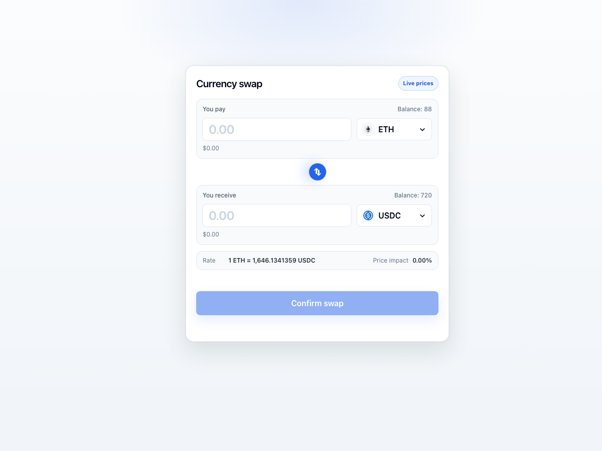

# Problem 2: Fancy Form

A Vite + React currency swap form using live token prices from Switcheo.

## Preview



## Run locally

```bash
npm install
npm run dev
```

Open the local URL printed by Vite, usually:

```text
http://localhost:5173/
```

## Build

```bash
npm run build
```

## Features

- Live token price loading with fallback demo prices.
- Token selector with token icons and USD prices.
- Automatic receive amount and exchange-rate calculation.
- Input validation for amount, same-token swaps, and insufficient balance.
- Mock swap confirmation with loading state.
- Responsive UI built with Tailwind CSS.
